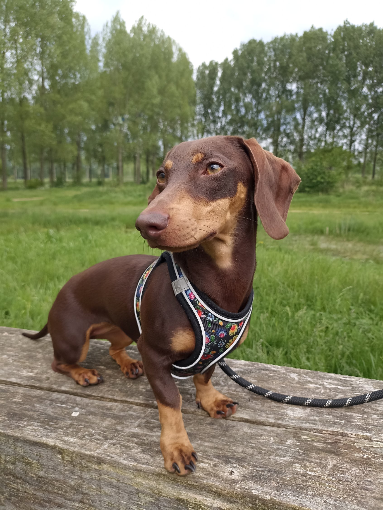

+++
title = "Meet Treta: The FortyTen Mascot"
date = 2023-03-01T11:00:00-07:00
draft = false
tags = ["mascot", "fun", "community"]
summary = "Who helps you write better stories in Hugo FortyTen? Treta, the mini dachshund with a passion for good content!"
+++

Say hello to **Treta**—she’s the official mascot of Hugo FortyTen!

Treta is a passionate mini dachshund who loves people that write good stories with our theme. Whenever she sniffs out a great blog, she wags her tail to celebrate. Her favorite pastime? Napping near your keyboard while brainstorming post ideas.

She wants you to know: “Good humans write great posts!”

You’ll meet Treta on this demo site and in every theme download. (Feel free to add her, or your own pet, to your site for extra fun!)
